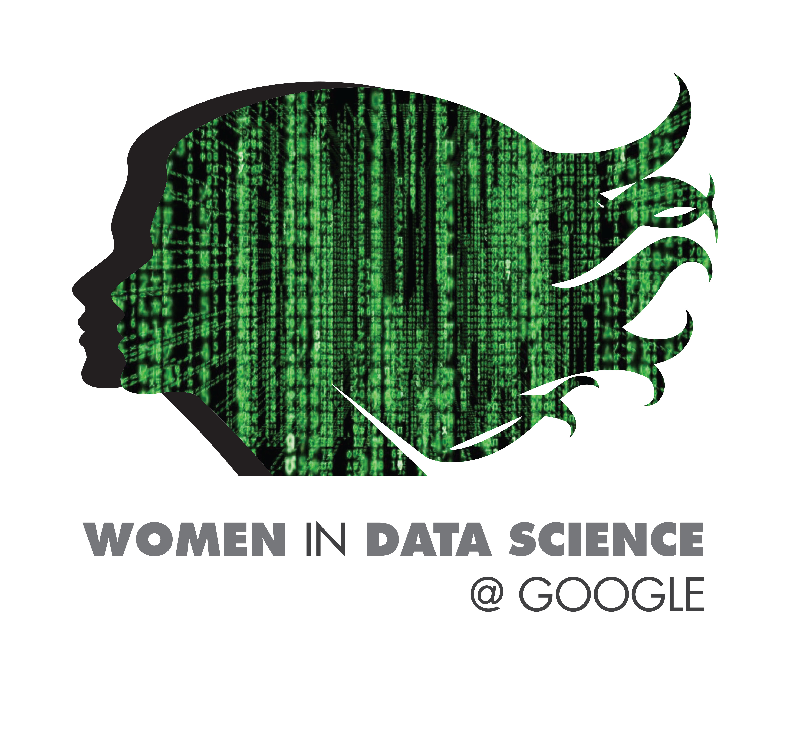

---

# WiDS@Google DATATHON WORKSHOP 2023

Welcome to the Women in Data Science @ Google Datathon Workshop 2023! 

## Important Links

[WiDS@Google How-to Guides](https://github.com/michevan/WIDS-Google/blob/main/instructions.pdf) - Introductory guides for all the tools used in the workshop including Github, Kaggle, Google Hangouts, and Colaboratory.

[Kaggle Competition](https://www.kaggle.com/c/widsdatathon2022) - This page hosts the Datathon challenge.

[WiDS Main Page](https://www.widsconference.org/datathon.html) - Home page for the Women in Data Science Datathon 2022 program.

The [resources.md](https://github.com/michevan/WIDS-Google/blob/main/resources.md) file contains a longer list of useful links as well.

---
